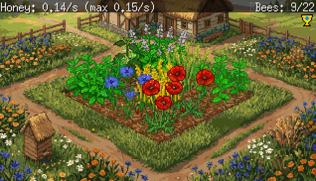

# Mokosh Garden 🌿

*A slop garden. An AI-assisted evening project.*

A small idle garden game built with [Ebiten](https://ebitengine.org/) and Go.
Tend a 3×3 plot of flowers, attract bees to your hive, and collect honey.



## How to play

| Action | Effect |
|---|---|
| **Click** a fully-grown plant | Replant it as a random type |
| **Hold** a fully-grown plant (0.5 s) | Open the plant picker *(unlocks at 20 bees)* |
| **Tab** | Toggle the achievement panel |
| **F1** | Debug overlay |

### Plants
Six plant types with different growth rates and bee values:
**Wheet**, **Chaber**, **Poppy**, **Yellow Flower**, **Nettle**, **Mint**.

### Bees
Bees emerge from the hive, visit grown flowers, collect pollen, and return home.
The colony size depends on how many flowers you have and how diverse they are.

### Visitors
Certain combinations of plants attract special visitors.
Discover the conditions yourself — or check the achievement panel.

## Build & run

```bash
go run .
```

Requires Go 1.20+ and a working C compiler (for Ebiten).

## Web (GitHub Pages)

> *Planned — coming soon.*

Build as WebAssembly and deploy to GitHub Pages via GitHub Actions.

```bash
GOOS=js GOARCH=wasm go build -o web/game.wasm .
```

## Credits

Pixel art assets: generated with [Pixel Labs](https://pixel-labs.app).  
Engine: [Ebiten v2](https://ebitengine.org/) by Hajime Hoshi.  
Code: largely AI-assisted ([Claude](https://claude.ai)).
